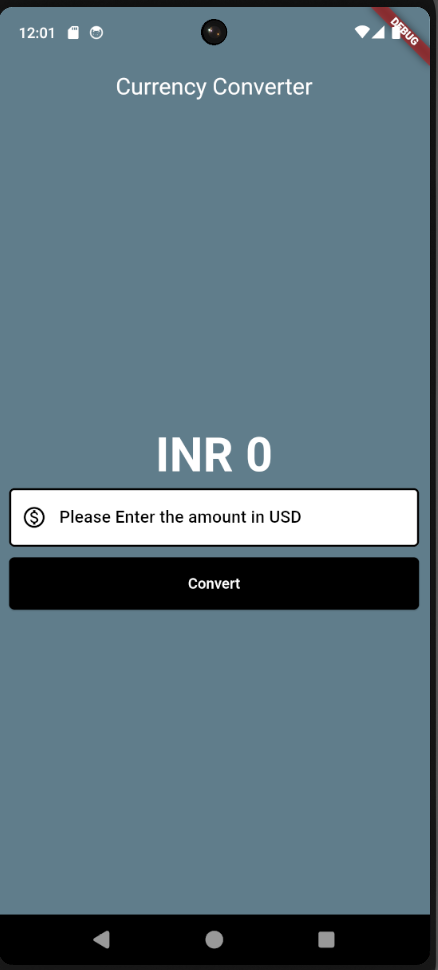
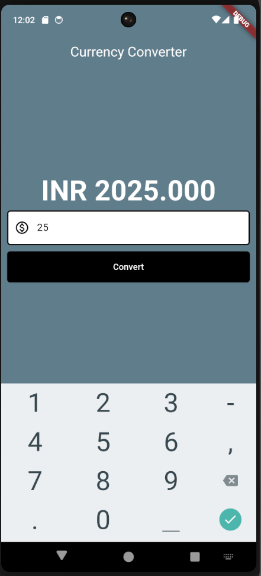

# Currency Converter App

## Description
This repository contains the source code for a basic currency converter app developed using Flutter. The app converts currency values from US Dollar (USD) to Indian Rupee (INR).

## Features
- **Real-time Currency Conversion:** Converts USD to INR based on the current exchange rate.
- **User-Friendly Interface:** Simple and intuitive UI designed with Flutter.
- **Responsive Design:** Works seamlessly on both Android and iOS devices.

## Technologies Used
- **Flutter:** UI toolkit for building natively compiled applications for mobile.
- **Dart:** Programming language optimized for building mobile apps.

## Getting Started
To run this app locally, follow these steps:

1. **Clone the repository:**
   ```sh
   git clone https://github.com/yourusername/currency-converter-app.git
   cd currency-converter-app

2. **Install dependencies:**
   ```sh
  flutter pub get


3. **Install dependencies:**
   ```sh
  flutter run


## Screenshots



